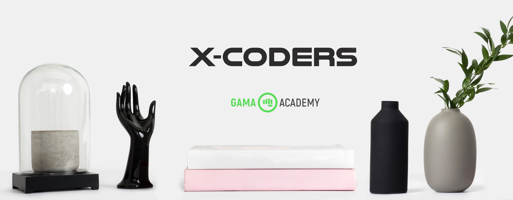
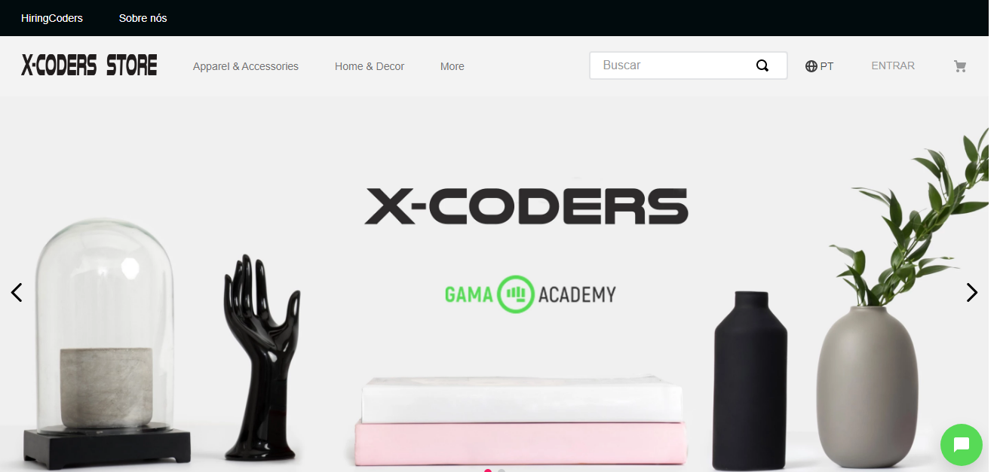
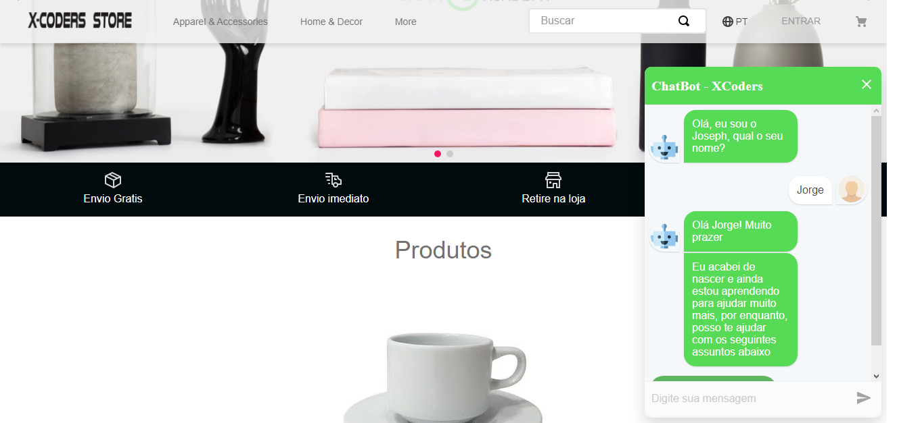

<h1 align="center">
    
</h1>

  

  

  

#### Projeto feito apenas para fins educativos para o programa HiringCoders em parceria com a Vtex

<h1 align="center">
    
</h1>

## 💻 Entenda o Projeto

O objetivo do grupo é desenvolver um canal
de comunicação baseado em Chatbot, que
possa “plugar" em outros marketplaces, e
que resolva o problema de tempo de resposta de atendimento e dificuldade em acompanhar a situação do pedido.

Nosso chatbot foi criado com intuito de facilitar a vida das pessoas,
proporcionando transparência sobre o pedido, agilidade no atendimento
e melhor interação com o cliente.

Fornecemos as ferramentas necessárias para responder os visitantes de
forma rápida e eficiente com menos distrações proporcionando serviço
de suporte ao cliente 24 horas.

<h1 align="center">
    
</h1>
<h1 align="center">
    
</h1>

## :clipboard: Principais conceitos utilizados

Para esse projeto, foi utilizado as principais bibliotecas do javascript, com o principal diferencial, que foi a integração com a VTEX Store Framework e VTEX IO, criando um componente "plugavel" para ecommerce.

Linguagens utilizadas

- TypeScript
- NodeJS
- React
  - react-simple-chatbot
- Api Rest / VTEX

## 🌐 Estrutura do backend

O backend foi estruturado para ser mantido em qualquer servidor que execulte node.
Utilizando typescript para manter a padronização e usando a biblioteca [Ominix](https://github.com/DWRP/ominix) para acelerar o desenvolvimento e seguindo a padronização de uma REST API.

Para hospedagem do projeto, a plataforma utilizada foi o [Heroku](https://heroku.com), que acompanha as mudanças deste repositório e atualiza a API conforme as mudanças.
O arquivo Procfile é o padrão da heroku para configurações do servidor. No caso deste projeto, o Procfile roda o comando que faz o servidor NodeJS iniciar. O package.json se manteve no root do projeto para ser encontrado pelo aplicativo heroku, pois o aplicativo instala o projeto no root do servidor e só reconhece o formato do servidor (NodeJS no nosso caso) se o arquivo de configuração estiver na raiz.

Para manter a segurança do projeto como um todo, a API é execultado através da branch Testing/Backend. Porém, nada impede da configuração atual da master de ser a base para o servidor da API.

Todo conteúdo do servidor está contido em store-backend. Separado por duas pastas:

**dev:**

    Contém todo conteúdo gerado durante o desenvolvimento e a pasta contendo a Build da aplicação gera

**prod:**

    Contém o conteúdo gerado na build e pastas extras do projeto.

O código na part de desenvolvimento é baseado num padrão de somente Controllers gerenciando a situação das rotas.
O server.ts mantém todas as configurações do servidor node utilizando express. As rotas em routes.ts definitem os endpoints que serão acessados e esses endpoints utilizam dos controllers para tratar as informações e responder ao requisitante.

Para manter a segurança das informações da VTEX, o projeto não mantém a informação de acesso a API da VTEX e nem as chaves de autenticação da mesma. Somente o aplicativo da heroku tem acesso a essas informações em suas variáveis de ambiente e o nosso código apenas acessa essas variáveis de ambiente.

Assim sendo, é possível reproduzir os mesmo resultados desta API em qualquer loja da VTEX, deste que mantenha o padrão https://{link_da_loja}/api e que siga a nomeclatura da documentação da API da VTEX.

Existe somente uma rota até o momento e a mesma retorna ao usuário. A rota <https://{link_da_api}/orders/{numero_da_ordem}> retorna ao usuário as seguintes informações em JSON:

- orderId: ID do pedido.
- statusDescription: Status dele no momento.
- value: Valor da compra (não formatado).
- erro: Vazio se encontrar o ID.
