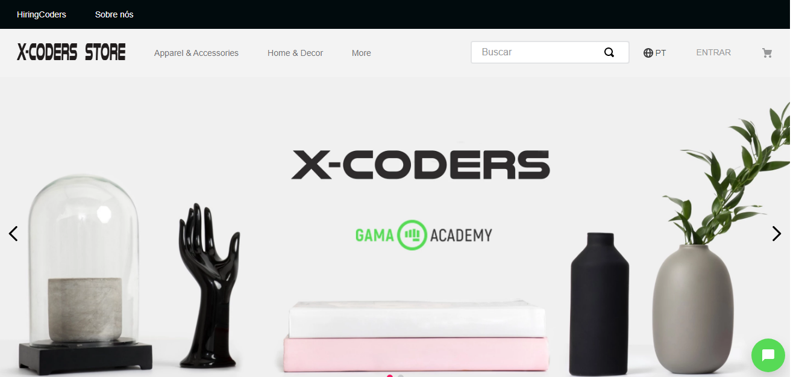

<h1 align="center">
    
</h1>

  

  

  

#### Projeto feito apenas para fins educativos para o programa HiringCoders em parceria com a Vtex

<h1 align="center">
    
</h1>

## 💻 Entenda o Projeto

O objetivo do grupo é desenvolver um canal
de comunicação baseado em Chatbot, que
possa “plugar" em outros marketplaces, e
que resolva o problema de tempo de resposta de atendimento e dificuldade em acompanhar a situação do pedido.

Nosso chatbot foi criado com intuito de facilitar a vida das pessoas,
proporcionando transparência sobre o pedido, agilidade no atendimento
e melhor interação com o cliente.

Fornecemos as ferramentas necessárias para responder os visitantes de
forma rápida e eficiente com menos distrações proporcionando serviço
de suporte ao cliente 24 horas.

<h1 align="center">
    
</h1>
<h1 align="center">
    
</h1>

## :clipboard: Principais conceitos utilizados

Para esse projeto, foi utilizado as principais bibliotecas do javascript, com o principal diferencial, que foi a integração com a VTEX Store Framework e VTEX IO, criando um componente "plugavel" para ecommerce.

Linguagens utilizadas

- TypeScript
- NodeJS
- React
  - react-simple-chatbot
- Api Rest / VTEX

